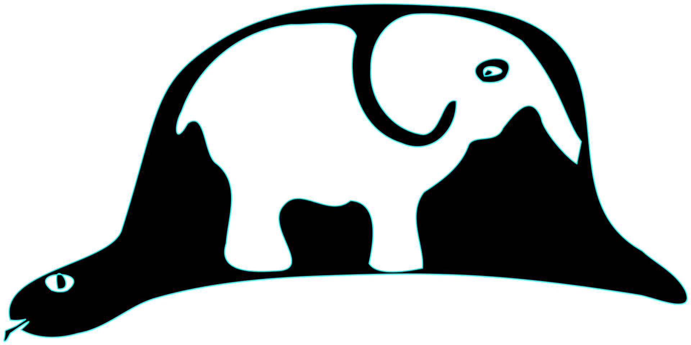

# Why the name?

This project was originally named `un_chapeau`, which is French for "a hat",
because it implemented a Mastodon server in Python. The reference is to a
passage in *Le Petit Prince* by Antoine de Saint-Exupéry (1900-1944):

> J'ai montré mon chef d'oeuvre aux grandes personnes et je leur ai demandé si mon dessin leur faisait peur.
>
> Elles m'ont répondu: "Pourquoi un chapeau ferait-il peur?"
>
> Mon dessin ne représentait pas un chapeau. Il représentait un serpent boa qui digérait un éléphant. J'ai alors dessiné l'intérieur du serpent boa, afin que les grandes personnes puissent comprendre. Elles ont toujours besoin d'explications. 

which in English means

> I showed my masterpiece to grown-ups, and asked them whether they were frightened by my drawing.
>
> They replied, "Why would we be scared of a hat?"
>
> My drawing didn't represent a hat: it represented a boa constrictor who was digesting an elephant. I drew the inside of the snake, so that the grown-ups could understand. They always need things explained to them.

A mastodon is an elephant, and a python is a snake, so a Mastodon server in Python is a hat.

The project used a hat-based naming scheme for the modules, [just as we have now](modules.md).
The ActivityPub side of things was named `kepi` at the time; [it became so complicated](bowler-heavy.md)
that for a while I split it out as a separate library.

When it turned out there was already a project called Chapeau, I took the opportunity to
merge the two repos together again, and renamed the whole thing "kepi". The original
`kepi` module became `bowler`.

## The default user image

The default user image comes from a prewar German magazine (from before the rise of the fascists), but I no longer remember which.

